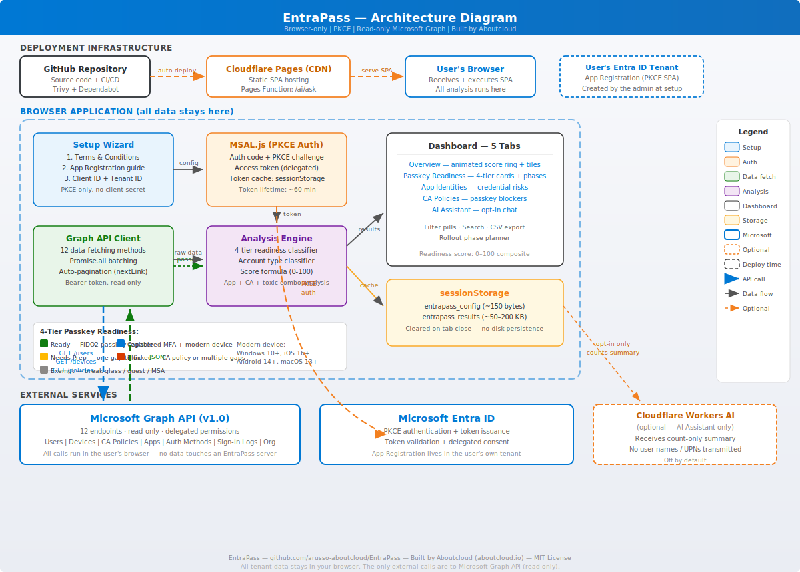

# 🔑 EntraPass — Passkey Migration Assistant

> **Assess your Microsoft Entra ID tenant's readiness for passkey (FIDO2) authentication.**
> Open source (MIT) · Browser-only · No data leaves your machine

[](https://entrapass.pages.dev)
[](https://github.com/arusso-aboutcloud/EntraPass/actions/workflows/security-scan.yml)
[](https://github.com/arusso-aboutcloud/EntraPass/actions/workflows/deploy.yml)
[](LICENSE)
[](CONTRIBUTING.md)

---

## What is EntraPass?

EntraPass is a **client-side browser application** that scans a Microsoft Entra ID
tenant and tells you how ready it is for **passkey (FIDO2) authentication**. It
answers questions like:

- Which users can use passkeys right now, and which are blocked?
- Which devices are running an OS too old for passkeys?
- Which Conditional Access policies block passkey registration?
- Which apps may silently fall back to passwords?

It runs entirely in your browser. The only network calls it makes are to the
Microsoft Graph API — there is no EntraPass backend, no database, and no telemetry.

---

## ✨ Features

| Feature | Description |
|---|---|
| **User Readiness Scan** | Analyzes users, devices, and auth methods to determine passkey readiness |
| **Device Compatibility** | Checks OS versions (Windows 10+, iOS 16+, Android 14+, macOS 13+) |
| **CA Policy Advisor** | Identifies Conditional Access policies blocking passkey registration |
| **Toxic Combination Detector** | Flags privileged users without MFA or passkey |
| **Entra Tip — App Check** | Bonus analysis of app compatibility, including Microsoft-managed apps |
| **AI Assistant** | Optional AI chat (Cloudflare Workers AI or bring-your-own-key) to interpret results |
| **Executive Summary** | Prioritized recommendations plus a phased rollout plan |
| **Security First** | PKCE auth, your own app registration, browser-only data |

### What it does **not** do

- **No write access** — read-only Microsoft Graph scopes only
- **No data storage** — everything stays in your browser's `sessionStorage`
- **No telemetry** — no analytics, no cookies, no tracking
- **No server** — zero backend, just static files on a CDN

---

## 🏗️ Architecture



### High-level flow

```
User's Browser (SPA)                    Microsoft Graph API
┌─────────────────────┐                 ┌───────────────────┐
│  Setup Wizard       │                 │  Users            │
│  → T&C + Config     │                 │  Devices          │
│  → MSAL PKCE Auth   │── Bearer ──────▶│  CA Policies      │
│  → Graph API Client │    Token        │  Applications     │
│  → Analysis Engine  │◀── JSON ────────│  Auth Methods     │
│  → Dashboard UI     │                 │  Sign-in Activity │
│  → sessionStorage   │                 │  Org Info         │
└─────────────────────┘                 └───────────────────┘
```

See the full [Architecture Document](docs/architecture.md) and
[Data Architecture](docs/data-architecture.md) for details.

---

## ⚡ Quick Start

### 1. Open the portal

Go to **[entrapass.pages.dev](https://entrapass.pages.dev)** (or your self-hosted URL).

### 2. Accept the Terms & Conditions

Read and acknowledge the T&C — this is required before proceeding.

### 3. Create an App Registration in **your** tenant

The scanner needs an App Registration (a **PKCE-only SPA**, no client secret) in
your Microsoft Entra ID tenant. The setup wizard offers three ways to create it:

| Method | Best for |
|---|---|
| **Azure Portal blade** (recommended) | Most users — the wizard links straight to the registration blade |
| **Azure Cloud Shell script** | Fastest — one command creates the app and all 7 permissions |
| **Manual PowerShell** | Advanced users who want full control |

See the [Installation Guide](docs/installation.md) for step-by-step instructions
for each method.

> **Note:** The Bicep template (`infra/app-registration.bicep`) is kept for
> reference only — `Microsoft.Graph/applications` Bicep deployment is not
> reliably supported, so use one of the three methods above instead.

### 4. Configure & sign in

Enter your **Client ID** and **Tenant ID** from the deployment, then sign in with
Microsoft and consent to the requested permissions.

### 5. Scan your tenant

Click **Scan Tenant Now** — all analysis happens in your browser.

### 6. Review & act

| Tab | What to look for |
|---|---|
| **Overview** | Stats, executive summary, recommendations, rollout plan |
| **Passkey Readiness** | Per-user status and blockers |
| **Entra Tip: Apps** | App compatibility with descriptions and fixes |
| **CA Policies** | Conditional Access policies blocking passkeys |
| **AI Assistant** | Ask questions about your results (opt-in) |

### 7. Clean up (optional)

```powershell
.\infra\cleanup-entrapass.ps1 -ClientId "<your-client-id>" -RevokeConsent
```

---

## 📚 Documentation

| Document | Description |
|---|---|
| [Architecture (HLD + LLD)](docs/architecture.md) | System architecture, components, flows |
| [Data Architecture](docs/data-architecture.md) | Data at each step, classification, lifecycle |
| [User Manual](docs/user-manual.md) | Full user guide with dashboard walkthrough |
| [Installation Guide](docs/installation.md) | Hosting, local dev, app registration, verification |
| [Contributing](CONTRIBUTING.md) | How to contribute |

---

## 🛡️ Security Scanning

The repository runs automated security scanning on every push and weekly:

| Scan | What it checks | Trigger |
|---|---|---|
| **Trivy — filesystem** | Vulnerabilities, secrets, misconfigurations | Push, PR, weekly |
| **Trivy — npm dependencies** | CRITICAL & HIGH vulnerabilities | Push, PR, weekly |
| **Dependabot** | Supply-chain vulnerabilities | Weekly (npm) + monthly (GitHub Actions) |

Trivy results are uploaded as SARIF to the **GitHub Security → Code scanning** tab.
The workflow is defined in [`.github/workflows/security-scan.yml`](.github/workflows/security-scan.yml).

---

## 🧑‍💻 Development

### Prerequisites

- **Node.js 18+** (CI builds on Node 22)
- **npm 9+**
- A **modern browser** (Chrome, Edge, Firefox, Safari)
- An **Entra ID tenant** plus rights to create an App Registration

### Setup

```bash
# Clone
git clone https://github.com/arusso-aboutcloud/EntraPass.git
cd EntraPass

# Install dependencies
npm install

# Dev server with hot reload (http://localhost:5173)
npm run dev

# Production build → dist/
npm run build

# Preview the production build locally
npm run preview
```

### Project structure

```
index.html                 # SPA entry point: setup wizard + dashboard markup
vite.config.js             # Vite build configuration
wrangler.toml              # Cloudflare Pages / Workers configuration

src/
  main.js                  # Application orchestration: MSAL, scan, rendering
  graph.js                 # Microsoft Graph API client
  analyzer.js              # Analysis engine (readiness, apps, policies, risks)
  style.css                # UI styling

workers/
  ai.js                    # Optional Cloudflare Worker for the AI Assistant

infra/
  app-registration.bicep   # Bicep template (reference only — see note above)
  app-registration.json    # ARM JSON template (reference)
  deploy-entrapass.ps1     # Cloud Shell deployment script
  cleanup-entrapass.ps1    # App Registration cleanup script

.github/workflows/
  deploy.yml               # Cloudflare Pages deployment
  security-scan.yml        # Trivy security scanning

docs/
  architecture.md          # HLD + LLD
  data-architecture.md     # Data flow documentation
  installation.md          # Installation guide
  user-manual.md           # User manual
  diagrams/
    architecture.svg       # Architecture diagram
```

### Environment variables

| Variable | Required | Description |
|---|---|---|
| `VITE_CLIENT_ID` | Optional | Client ID — if set with `VITE_TENANT_ID`, skips the setup wizard |
| `VITE_TENANT_ID` | Optional | Tenant ID — if set with `VITE_CLIENT_ID`, skips the setup wizard |

Set them in a `.env` file (git-ignored) for local development, or as build-time
secrets in CI. When both are present the wizard is bypassed and the app goes
straight to sign-in.

---

## 🔐 Security model

- **PKCE (S256)** — authorization code flow with Proof Key for Code Exchange
- **No client secret** — SPA apps don't need one and can't store one securely
- **Your own tenant** — the App Registration lives in *your* tenant, not a shared one
- **Delegated permissions** — the app acts on behalf of the signed-in user
- **Read-only scopes** — no write operations against Graph
- **Browser-only data** — no servers, no databases, no analytics
- **No cookies** — `sessionStorage` only, cleared when the tab closes
- **Open source** — full transparency, build verifiable from source

### Required permissions (Microsoft Graph, delegated)

| Permission | Purpose |
|---|---|
| `User.Read` | Sign in and read the signed-in user's profile |
| `User.Read.All` | List all users in the tenant |
| `Device.Read.All` | List all devices and their OS versions |
| `Policy.Read.All` | Read Conditional Access and authentication-method policies |
| `Application.Read.All` | Read app registrations for the compatibility check |
| `AuditLog.Read.All` | Read sign-in activity (last sign-in time) |
| `Organization.Read.All` | Read the tenant display name |

---

## 🤝 Contributing

Contributions are welcome. Please read [CONTRIBUTING.md](CONTRIBUTING.md), then:

1. Fork the repository
2. Create a feature branch
3. Open a Pull Request

---

## 📄 License

MIT License — see [LICENSE](LICENSE) for details.

---

## 💬 Support

- **Issues**: [GitHub Issues](https://github.com/arusso-aboutcloud/EntraPass/issues)
- **Discussions**: [GitHub Discussions](https://github.com/arusso-aboutcloud/EntraPass/discussions)
- **Security**: report vulnerabilities privately via GitHub Security Advisories

---

> Built for the passkey community — because phishing-resistant authentication
> shouldn't be hard to adopt.
